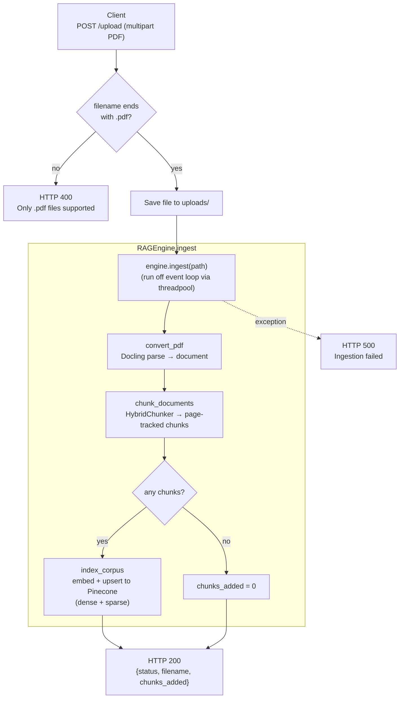
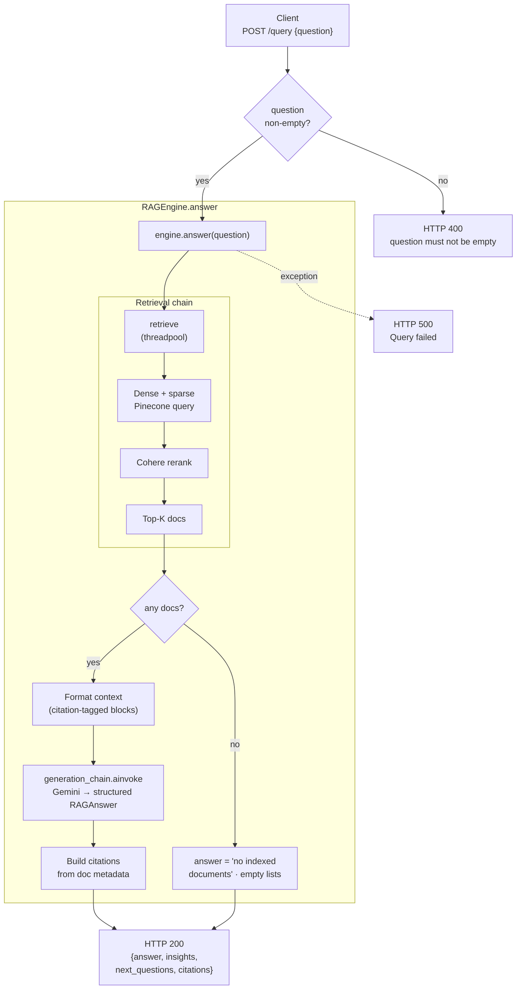
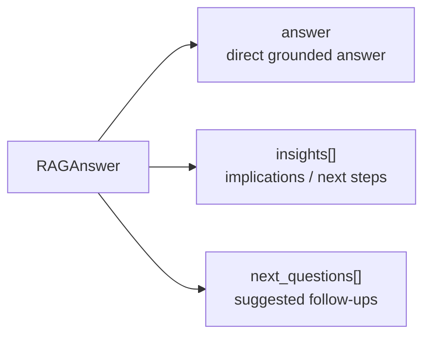

# API Endpoint Flowcharts

Mermaid flowcharts for the two application endpoints. `GET /health` (liveness) is
omitted intentionally.

## `POST /upload` — ingest a PDF

## `POST /query` — answer a question

### Structured generation output (`RAGAnswer`)

